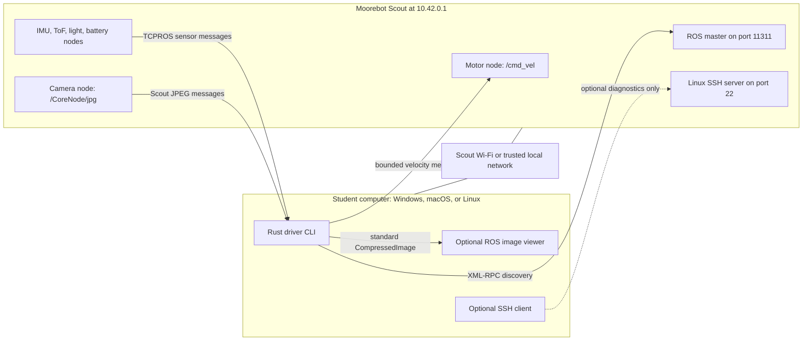

# Student getting-started guide

This guide assumes you are new to robots and ROS. By the end, you will have
downloaded one program, connected it to a Moorebot Scout, driven with WASD,
saved camera pictures with Space, and optionally inspected the robot's sensors.

## What is the Moorebot Scout?

The Scout is a small mobile monitoring robot built on Linux and ROS. It has four
Mecanum wheels, a 1080p camera with infrared night vision, a microphone and
speaker, an IMU motion sensor, an ambient-light sensor, a forward
time-of-flight distance sensor, and a charging dock. Its normal phone app can
drive it, show video, and run saved patrols. Moorebot presents it as both a
home-monitoring device and an educational/open-source robotics platform; see
the [official product overview](https://www.moorebot.com/products/moorebot-scout)
and [official open-source control
repository](https://github.com/Pilot-Labs-Dev/Scout-open-source).

This project replaces the difficult Python/MATLAB computer setup with one
program. The first version can drive the robot from the keyboard, save color
camera pictures, inspect the robot, read several sensors, and bridge the camera
into a standard ROS message. Other capabilities found in the Scout source—such
as night mode, patrols, docking, recording, audio, and onboard detections—are
listed for future work but are not yet exposed as working commands.

The driver talks to ROS 1 already running on the Scout. You do **not** need to
install ROS, Python, MATLAB, or custom Moorebot message packages to build it or
use its command-line tools. A separate ROS installation is useful only if you
want graphical tools such as `rqt_image_view`.

## How the computer and Scout connect



The Rust driver does **not** run commands through SSH. It first asks the ROS
master where topics live, and then ROS nodes open direct TCPROS connections to
exchange messages. The program automatically asks the operating system which
local address reaches the robot and advertises it for those return connections.
SSH is a separate, optional way to open a Linux terminal on the robot for
diagnostics.

## Safety first

The driver has offline tests, but its motion directions and sensor units have
not yet been validated on a physical Scout.

- Do discovery and sensor exercises before motion.
- For the first motion test, place the Scout on a stable stand with every wheel
  clear of the table or floor.
- Keep hands, hair, cables, and loose clothing away from the wheels.
- Keep one hand ready at the robot's physical power control.
- Use the low speed and short duration shown in this guide.
- Do not test near stairs, table edges, people, or animals.

You do not need root access to the Scout, and this guide does not ask you to
change software on the robot.

## Four terms you need

| Term | Plain-language meaning |
|---|---|
| ROS master | The directory service on the Scout. Its usual address is `http://10.42.0.1:11311`. |
| Node | One program participating in ROS, such as the Scout motor controller or this driver. |
| Topic | A named stream of messages. `/cmd_vel` carries movement commands. |
| Advertised address | Your computer's address on the Scout network. The robot uses it to connect back to the driver. |

The robot address and computer address are different. In direct-connect mode,
the robot is commonly `10.42.0.1`; your computer will normally have another
`10.42.0.x` address. Never advertise `127.0.0.1`, because that means "this same
machine" to whichever computer reads it.

## 1. Download the program

Open the project's [GitHub Releases
page](https://github.com/cmontella/moorebot-scout/releases) and download the
newest package for your computer:

| Computer | Package name |
|---|---|
| Apple Silicon Mac (M1, M2, M3, and newer) | `moorebot-scout-aarch64-apple-darwin.tar.gz` |
| Intel Mac | `moorebot-scout-x86_64-apple-darwin.tar.gz` |
| 64-bit Windows | `moorebot-scout-x86_64-pc-windows-msvc.zip` |

Extract the downloaded package. It contains just `moorebot-scout` on a Mac or
`moorebot-scout.exe` on Windows. You do not need to install Rust, ROS, Git,
Python, or MATLAB. Windows users can also download the standalone
`moorebot-scout.exe` release asset directly instead of the ZIP.

These early releases are not yet code-signed. Windows SmartScreen or macOS
Gatekeeper may therefore ask you to confirm that you trust the download. Only
continue if it came from the `cmontella/moorebot-scout` release page. On macOS,
use **System Settings → Privacy & Security → Open Anyway** if Gatekeeper blocks
it; do not globally disable Gatekeeper. On Windows, inspect the publisher
warning before choosing **More info → Run anyway**. The release also provides
`SHA256SUMS` if an instructor wants to verify the download.

Open Terminal on macOS or PowerShell on Windows, change into the extracted
folder, and check the program:

```text
# macOS
chmod +x ./moorebot-scout
./moorebot-scout --help

# Windows PowerShell
./moorebot-scout.exe --help
```

The examples below show the macOS spelling. On Windows, replace
`./moorebot-scout` with `./moorebot-scout.exe`.

### Optional: build the same program from source

Developers who want to change the driver can install [Git](https://git-scm.com/downloads)
and [Rust](https://rustup.rs/), then run:

```text
git clone https://github.com/cmontella/moorebot-scout.git
cd moorebot-scout
cargo build --release
cargo test --all-targets
```

The built program is `target/release/moorebot-scout` on macOS/Linux or
`target/release/moorebot-scout.exe` on Windows. The rest of this guide assumes
the program has been copied into the current folder.

## 2. Join the Scout network

1. Power on the Scout.
2. Connect your computer to the Wi-Fi network created by the Scout. The
   factory-default name is `robot_scout_xxxxxx` and the factory-default Wi-Fi
   password is `r0123456`, according to the [official Scout
   FAQ](https://www.moorebot.com/pages/faq-for-moorebot-scout-2). The FAQ says
   to change this default after the first login. A Scout already configured in
   access-point mode may instead be on the same trusted local network as your
   computer.
3. Confirm the computer received an address on that network.

On Windows, run `ipconfig` and find the `IPv4 Address` under the active Wi-Fi
adapter. On macOS, first try `ipconfig getifaddr en0`; if that prints nothing,
use `ifconfig` and find the active Wi-Fi interface. On Linux, use `ip -4 addr`.

In direct-connect mode, the address usually begins with `10.42.0.`. You do not
need to copy it into normal driver commands: the program selects the route to
the Scout automatically, even when Ethernet, VPN, or virtual adapters are also
present.

Check whether the robot responds:

- Windows: `ping -n 1 10.42.0.1`
- macOS/Linux: `ping -c 1 10.42.0.1`

A blocked ping does not always mean the robot is unreachable, but a successful
reply confirms the basic route.

## 3. Optional: open an SSH diagnostic shell

**Skip this section for normal driver use.** ROS connections do not require
SSH, and none of the driver commands below depend on it.

The supplied course archive reports this factory/lab SSH login:

| Setting | Supplied value |
|---|---|
| Address | `10.42.0.1` |
| Username | `linaro` |
| Password | `linaro` |

Firmware and classroom configuration may differ. From PowerShell or a
macOS/Linux terminal, try:

```text
ssh linaro@10.42.0.1
```

On the first connection, SSH asks whether you trust the host key. Verify that
you are connected directly to the expected Scout before accepting it. The
password is not displayed while you type. Once connected, safe read-only checks
include:

```text
hostname
ip addr
pgrep -a rosmaster
```

Type `exit` to close the shell. Do not use `sudo`, enable root access, delete
robot files, or change startup services for these exercises. If SSH is disabled
but the ROS master responds on port 11311, the Rust driver can still work.

Factory credentials are public and should not remain enabled on a robot placed
on a shared network. Change them using the supported Moorebot setup process,
record classroom-specific credentials somewhere private, and never put real
passwords into an issue or discovery capture.

## 4. Discover the robot

Run this from the project directory:

```text
./moorebot-scout discover
```

The command asks the Scout's ROS master for every published topic and
registered service. Part of a successful result should resemble this:

```text
ROS master: http://10.42.0.1:11311
Published topics:
  /CoreNode/jpg                              roller_eye/frame                 JPEG camera [Bridge]
  /SensorNode/imu                            sensor_msgs/Imu                  6-axis IMU [Read]
Registered services:
  ...
```

Your list may differ with firmware version and robot state. `Read`, `Write`, or
`Bridge` means this version of the driver implements that interface.
`DiscoveredOnly` means the driver recognizes it but does not yet claim that it
works.

If the output mentions `linaro-alip` or a later command cannot resolve that
name, add this single mapping to your computer's hosts file:

```text
10.42.0.1 linaro-alip
```

- Windows hosts file: `C:\Windows\System32\drivers\etc\hosts` (open the editor
  as Administrator).
- macOS/Linux hosts file: `/etc/hosts` (editing requires administrator access
  on your computer, not on the robot).

Run `discover` again after saving the file.

## 5. Read the sensors

Monitoring now continues until you press Ctrl-C:

```text
./moorebot-scout monitor
```

Representative output looks like this; your numbers will change continuously:

```text
imu    accel=(+0.012, -0.031, +9.801) m/s² gyro=(+0.001, +0.000, -0.002) rad/s
tof    range=0.375 m
light  raw=8061384 channels=(CH0=123, CH1=456)
battery 87% Discharging external_power=false
```

The program listens for the IMU, time-of-flight distance sensor, ambient-light
sensor, and battery state. Some Scout nodes start publishing only after a
subscriber appears, so `waiting for sensor publishers...` can be normal for a
few seconds.

Use `--seconds` when you want a fixed-duration sample:

```text
./moorebot-scout monitor --seconds 30
```

The displayed units follow the ROS message definitions, but physical scaling,
orientation, and firmware differences still require hardware validation.

## 6. Perform the first motion test

Complete this checklist first:

- The Scout is stable with all wheels off the surface.
- The area around every wheel is clear.
- `discover` completes successfully, confirming basic ROS connectivity.
- You know where the physical power control is.
- Another person nearby knows that the wheels may move.

Then request only 0.05 m/s forward for 250 milliseconds:

```text
./moorebot-scout drive --forward 0.05 --duration-ms 250
```

The driver refuses to move if no `/cmd_vel` subscriber connects within three
seconds. It caps requested speeds, limits a command to 60 seconds, and sends a
zero-velocity command after normal completion, an error, or Ctrl-C. These are
software safeguards, not a replacement for the physical precautions above.

Once the first command is understood, these are separate low-speed examples:

```text
# Ask for backward motion
./moorebot-scout drive --forward -0.05 --duration-ms 250

# Ask for leftward motion
./moorebot-scout drive --lateral 0.05 --duration-ms 250

# Ask for a counter-clockwise turn
./moorebot-scout drive --yaw 2.0 --duration-ms 250
```

Those direction names are the driver's intended standard coordinate semantics.
Confirm the real wheel directions while the robot is still on the stand and
report discrepancies in the hardware-validation issue.

## 7. Drive with WASD and save pictures

Only try interactive driving after the short motion test above behaves as
expected. Put the Scout on the floor in a clear, level area away from stairs,
edges, people, pets, and loose cables. Keep the terminal window focused and be
ready to use the physical power control.

Start the keyboard controller:

```text
./moorebot-scout teleop
```

| Key | Result |
|---|---|
| W | Drive forward |
| S | Drive backward |
| A / D | Strafe left / right |
| Q / E | Turn left / right |
| Up / Down | Increase / decrease speed and control rate |
| Space | Stop, then save the latest camera image as a new JPEG |
| Escape or Ctrl-C | Stop and exit |

Hold or repeatedly tap a movement key. The program allows up to 1.1 seconds
after the first press for the computer's normal key-repeat delay. Once repeats
begin, it stops a direction within 350 milliseconds if those events cease.
Terminals that report key-release events stop that direction immediately on
release. This means a quick tap on a legacy terminal can continue for up to 1.1
seconds, so the default speed remains deliberately low. These timers and the
final stop command reduce risk, but neither can protect against a crashed robot
process, a broken network, or loss of power to the computer.

Pictures are saved on the Desktop with names such as
`scout-1788990123456-frame-42.jpg`. Pressing Space before a valid JPEG arrives
prints a message and does not create a file. To use a different folder or lower
speeds, add options after `teleop`:

```text
./moorebot-scout teleop --speed 0.05 --strafe-speed 0.05 --picture-directory scout-pictures
```

The base forward and strafe speeds are 0.10 m/s. The default turn rate is 2.0
rad/s because lower yaw can fall below the physical motor driver's reliable
duty threshold. The Scout firmware mixes each forward, strafe, and turn command
across all four Mecanum wheels. Teleop samples and publishes at 40 Hz; Up/Down
changes both velocity and rate in 25% steps and displays the new values.

The program refuses values above the Scout safety limits, refuses motion when
no `/cmd_vel` subscriber connects, never overwrites an existing picture, and
accepts only bounded, well-formed JPEG frames from the configured camera topic.
Run `./moorebot-scout teleop --help` to see the control summary and every option.

## 8. Bridge the color camera

Start the bridge in one terminal:

```text
./moorebot-scout camera-bridge
```

It converts the Scout-specific `/CoreNode/jpg` messages into standard ROS 1
`sensor_msgs/CompressedImage` messages on:

```text
/moorebot_scout/camera/image/compressed
```

The terminal reports how many frames were forwarded or dropped when the bridge
stops. To display the stream, a second computer program must subscribe to the
output topic. For example, on a computer with ROS 1 desktop tools installed:

```text
rqt_image_view /moorebot_scout/camera/image/compressed
```

The Rust bridge itself still does not require a local ROS installation. Media
payloads above 16 MiB are rejected, and the bridge should be used only on a
trusted, isolated robot network because ROS 1 does not authenticate publishers.

## Troubleshooting

### `cargo`, `rustc`, or `git` is not recognized

Close and reopen the terminal after installation. If that does not help,
re-run the relevant installer and allow it to update your PATH.

### The driver cannot contact `10.42.0.1:11311`

Confirm that the Scout is powered on and that the computer is connected to the
correct network. Recheck the robot address. A VPN, firewall, campus network
policy, or virtual-machine network can block ROS connections.

On Windows, `Test-NetConnection 10.42.0.1 -Port 11311` checks the ROS master
port. On macOS/Linux, `nc -vz 10.42.0.1 11311` performs the same check when
Netcat is installed.

### The master responds, but subscriptions fail

The program normally selects the advertised address automatically. Add the
`linaro-alip` hosts entry described above if the error names that host. For an
unusual routed setup, `--advertise-address 10.42.0.x` manually overrides route
selection; it must be the computer's address, not the robot or `127.0.0.1`.

### `no subscriber connected to /cmd_vel`

The driver deliberately refused to send motion because it could not confirm a
motor-node subscriber. Run `discover`, verify the robot is fully booted, and
check address/firewall settings. Do not bypass this guard.

### Sensor monitoring keeps waiting

Allow several seconds for subscription-driven Scout nodes to start. If nothing
arrives, save the `discover` output, note the Scout model and firmware version,
and attach them to [hardware capture issue
#1](https://github.com/cmontella/moorebot-scout/issues/1).

### How to capture useful diagnostic output

The following saves discovery output to a file on every supported platform:

```text
./moorebot-scout discover > scout-discover.txt
```

Before sharing the file, remove private network names, addresses you do not
want public, credentials, and other identifying information. Never post Wi-Fi
passwords or private keys.
