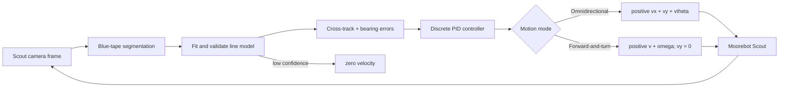

# CSE360 — Vision-Based Line Following with the Moorebot Scout

- **Due:** Set by your instructor
- **Work format:** Set by your instructor
- **Robot:** Moorebot Scout with Mecanum wheels
- **Control software:** `moorebot-scout` v0.2.0 or newer, using either Python or MATLAB

## Overview

In this lab you will build and evaluate a vision-based controller that follows
a blue painter's-tape line on a gray concrete floor. You will not begin by
driving the robot. First you will collect camera data, segment the tape, fit a
geometric model to the detected line, and measure how accurately that model
estimates the line's position and bearing.

You will then model a PID controller and test two different ways to use the
Scout's motion capabilities:

1. **Omnidirectional control:** the robot moves forward while using lateral
   velocity to slide toward the line. It may also use angular velocity to align
   its body with the line.
2. **Forward-and-turn control:** lateral velocity is fixed at zero. The robot
   must use only a positive forward velocity, `v`, and angular velocity,
   `omega`, while the line is visible. This makes the Scout behave like a
   nonholonomic differential-drive robot even though its hardware is
   omnidirectional.

You will tune and compare the controllers using measured error, recovery time,
oscillation, speed, and course-completion results.



## Learning objectives

By the end of the lab, you should be able to:

- collect a camera dataset that represents the conditions a mobile robot will
  encounter;
- segment a colored target under real lighting instead of choosing thresholds
  from one convenient image;
- fit and draw a line model from segmented pixels;
- calculate signed cross-track and bearing errors in image coordinates;
- implement a discrete PID controller using measured time intervals;
- explain the roles of the proportional, integral, and derivative terms;
- prevent integral windup and stop safely when visual feedback is lost;
- apply the same perception output to omnidirectional and `v, omega` control;
- tune controllers from data and compare them with quantitative evidence.

## Materials

- one Moorebot Scout and charger;
- a laptop running Windows, macOS, or Linux;
- the correct `moorebot-scout` release package for the laptop;
- Python 3.10 or newer **or** MATLAB R2020b or newer;
- blue painter's tape;
- a measuring tape;
- a gray concrete test area;
- removable floor markers for start positions, if provided by your instructor;
- a stable stand for the first motion tests.

## Safety requirements

The robot will eventually operate on the floor, but perception and controller
errors can make it move unexpectedly.

- Build the course away from stairs, doors, table edges, people, and traffic.
- Use painter's tape approved for the floor. Remove it when the lab is over.
- Perform every first motion test with all four wheels clear of the floor.
- Keep speeds low until the controller has passed the staged tests in this lab.
- Assign one person to watch the robot and stay ready to use its physical power
  control during every floor trial.
- Every control program must send an explicit stop in its cleanup path.
- Use a command timeout between 0.25 and 0.5 seconds. Refresh commands faster
  than the timeout; if the program freezes, the Rust bridge will then command
  zero velocity.
- Stop when the line is lost. Do not continue on the last steering command.
- Do not reach toward a moving robot.

## Coordinate convention

The driver accepts velocity commands in the vector
`[vx, vy, vtheta]`:

| Command | Positive direction | Unit |
|---|---|---|
| `vx` | forward | m/s |
| `vy` | left strafe | m/s |
| `vtheta` | counter-clockwise turn | rad/s |

In the second controller, use the conventional names
`v = vx` and `omega = vtheta`, with `vy = 0`.

An image uses a different coordinate system. Pixel column `u` increases to the
right, and pixel row `r` increases downward. Do not guess the necessary sign
conversion. Include a stationary sign test in which you place the line to the
left and right of the image center and verify the direction of the correction
your program would request.

## Software setup

### 1. Start the Rust bridge

Connect the laptop to the Scout network. Open a terminal in the extracted
release folder and leave the bridge running for the entire experiment:

```text
# Windows PowerShell
./moorebot-scout.exe bridge

# macOS or Linux
./moorebot-scout bridge
```

If your Scout is on a router, put its address before the command, for example:

```text
./moorebot-scout --master http://192.168.1.73:11311 bridge
```

The bridge maintains the ROS connection, publishes motor commands at 40 Hz,
and makes camera frames and motion commands available on two localhost ports.
Leave its terminal visible so you can see connection errors. Pressing Ctrl-C in
that terminal stops the robot and exits.

### 2. Choose Python or MATLAB

For Python, install the supplied client and vision dependencies from the
release folder:

```text
python -m pip install "./integrations/python[vision]"
```

Import the client with:

```python
from moorebot_scout import ScoutClient
```

For MATLAB, add the supplied client folder:

```matlab
addpath("integrations/matlab")
```

Create the client with:

```matlab
scout = MoorebotScout();
```

Use a Python context manager or MATLAB `onCleanup` object so an error still
causes an explicit stop. The supplied `live_camera`/`liveCamera` and
`continuous_commands`/`continuousCommands` examples demonstrate the separate
camera and command interfaces. They do not implement this lab's solution.

---

## Part 1A — Build the tape course and collect images

Do not send motion commands in this part.

### 1.1 Build the course

Use blue painter's tape on the gray concrete to build a course containing:

- a straight segment at least 2 m long;
- one gradual left curve;
- one gradual right curve; and
- enough straight tape before the first curve to place and align the robot.

Use the measuring tape to record the straight length and approximate curve
radii. The line must remain fully inside the test area with clearance around
the robot.

Draw a course diagram in your lab report. Label dimensions, travel direction,
start position, and camera-facing direction.

### 1.2 Define a capture matrix

Before capturing images, make a table of conditions. At minimum, collect the
following while the robot is stationary:

| Variable | Required settings |
|---|---|
| Lateral line position | centered, 10 cm left, 10 cm right, 20 cm left, 20 cm right |
| Robot heading relative to tape | 0°, approximately 10° left/right, approximately 20° left/right |
| Course geometry | straight, left curve, right curve |
| Lighting | at least two conditions available in the lab |

You do not need every possible combination, but your dataset must contain at
least **30 images** and must cover every row of the table. Record the physical
offset, heading, geometry, lighting, and filename for each image.

### 1.3 Capture and label the images

Request individual images from the bridge. For example, Python exposes
`read_jpeg()` and `read_image()`, while MATLAB exposes `readJpeg()` and
`readImage()`.

Save the original, unmodified images. Use filenames or a CSV/MAT table that
connect each image to its measured capture condition. Do not tune segmentation
on all images. Divide the data before tuning:

- **calibration set:** approximately 60%;
- **validation set:** approximately 20%;
- **test set:** approximately 20%.

Choose thresholds using only the calibration set. Use the validation set for
adjustments. Report final accuracy on the untouched test set.

### Checkpoint A

Show the instructor or teaching assistant:

- the measured course diagram;
- the capture-condition table;
- at least 30 labeled original images; and
- the calibration/validation/test split.

---

## Part 1B — Segment the blue line

Your program must distinguish blue tape from gray concrete and return a binary
mask in which line pixels are true.

### 2.1 Select a color representation

Compare RGB with a representation that separates color from brightness, such
as HSV. Explain which one you selected and why. A useful blue detector normally
uses a hue interval plus a minimum saturation; a brightness constraint may
help under shadows or glare.

Important: OpenCV and MATLAB scale HSV values differently. Record thresholds
in the units used by your program rather than copying unexplained values from
another implementation.

### 2.2 Measure rather than guess

Select pixels from blue tape and gray floor across several calibration images.
Plot or tabulate their color-channel distributions. Choose initial bounds from
those measurements.

For every threshold you use, report:

- its value and units;
- the measurement or plot that motivated it; and
- what happens when the threshold is raised or lowered.

### 2.3 Restrict the region of interest

Define a region of interest (ROI) in the lower portion of the image where the
floor and tape should appear. The ROI should exclude walls, furniture, and as
much distant clutter as practical while retaining enough forward view to
estimate bearing.

Draw the ROI boundary on a sample image. Report its bounds as fractions of
image width and height so it continues to work if resolution changes.

### 2.4 Clean the mask

Real masks may contain isolated blue pixels, holes, glare, or multiple blobs.
Evaluate at least two of the following:

- remove connected components below a measured area;
- morphological opening to remove isolated pixels;
- morphological closing to fill small holes;
- retain the component that intersects the bottom of the ROI;
- retain the component most consistent with the previous frame's line model.

Do not silently return a line from noise. Define a detection-confidence rule,
such as a minimum number of pixels and a minimum span across image rows.

### 2.5 Evaluate segmentation

Manually mark tape/non-tape pixels on representative test crops, or construct
a small hand-labeled mask set. Report at least precision and recall, or
intersection-over-union (IoU), on the test set. Include failure examples.

### Checkpoint B

Submit or demonstrate:

- original image;
- raw color mask;
- cleaned mask;
- ROI overlay;
- threshold-selection evidence; and
- segmentation metrics on images not used for threshold selection.

---

## Part 2 — Fit and draw a line model

A mask alone is not a control measurement. Convert the segmented pixels into a
geometric model.

### 3.1 Fit the model

Inside the ROI, fit image column as a function of image row:

```text
u(r) = a r + b
```

This form works better than fitting `r` as a function of `u` when the desired
line is close to vertical. You may use least squares, weighted least squares,
PCA, or a robust method such as RANSAC. Explain your choice.

If you use ordinary least squares, identify when outliers can pull the fitted
line away from the tape. If you use a robust method, report its inlier rule.

### 3.2 Choose near, far, and lookahead rows

Within the ROI define:

- `r_near`: a row near the bottom of the image;
- `r_far`: a row near the top of the ROI; and
- `r_lookahead`: the row at which lateral position is evaluated.

Compute:

```text
u_near = a r_near + b
u_far  = a r_far  + b
u_L    = a r_lookahead + b
u_C    = (image_width - 1) / 2
```

### 3.3 Calculate the errors

Use a normalized lateral error that is positive when the desired correction is
to the robot's left:

```text
e_y = (u_C - u_L) / (image_width / 2)
```

With this definition, `e_y` is approximately in `[-1, 1]` while the modeled
line remains in the image.

Estimate the signed bearing error from the fitted line:

```text
e_heading = atan2(u_near - u_far, r_near - r_far)
```

`e_heading` is in radians. Verify the sign with stationary left/right examples.
If the camera image is mirrored or mounted differently, document and correct
the sign once at the camera-to-robot boundary.

### 3.4 Draw the model on the image

Every debug image must show:

- the image centerline;
- the ROI boundary;
- the segmented tape, using a transparent colored overlay;
- the fitted line from `r_far` to `r_near`;
- the lookahead point `(u_L, r_lookahead)`;
- an arrow from the image center to the lookahead point;
- a line or arrow indicating estimated bearing; and
- numerical labels for `e_y`, `e_heading`, pixel count, and confidence.

Use a different warning color when confidence is insufficient. In that state,
the controller must not produce a motion command from the line model.

### 3.5 Measure model accuracy

On at least 10 test images, manually mark the line location at the lookahead
row and its approximate direction. Compare those labels with the fitted model.
Report:

- mean absolute lookahead error in pixels;
- maximum absolute lookahead error in pixels;
- mean absolute bearing error in degrees; and
- the number of rejected or missing detections.

### Checkpoint C

Show model overlays for centered, left, right, angled, curved, shadowed, and
failed-detection cases. The robot may not begin floor motion until the program
reliably reports low confidence for images with no usable line.

---

## Part 3 — Model the PID controller before driving

### 4.1 Discrete PID equations

Use the actual measured time between frames, `dt`, rather than assuming the
camera always has the same frame rate:

```text
P_k = e_k
I_k = clamp(I_(k-1) + e_k dt, -I_max, I_max)
D_raw,k = (e_k - e_(k-1)) / dt
D_k = alpha D_(k-1) + (1 - alpha) D_raw,k
u_k = Kp P_k + Ki I_k + Kd D_k
```

Clamp `u_k` to the selected lateral-velocity or angular-velocity limit. The
filtered derivative reduces amplification of pixel noise. Choose and report
`alpha`, `I_max`, and the output limits.

Your implementation must reset or freeze the integral term when:

- the line is lost;
- the controller is stopped;
- the output is saturated in a direction that would increase windup; or
- a new trial starts.

### 4.2 Choose the controller error

For omnidirectional lateral control, use `e_y` as the PID error. Bearing can be
handled by a separate proportional or PD alignment term.

For forward-and-turn control, create a steering error that includes both line
position and bearing. One reasonable form is:

```text
e_steer = w_y e_y + w_heading (e_heading / heading_scale)
```

The weights and `heading_scale` are design parameters. You may propose another
form, but it must be dimensionally explained and tested offline.

### 4.3 Kinematic model

Model the robot pose as `(x, y, theta)`. With body-frame commands
`(vx, vy, omega)`, use:

```text
x_dot     = vx cos(theta) - vy sin(theta)
y_dot     = vx sin(theta) + vy cos(theta)
theta_dot = omega
```

For the forward-and-turn controller, set `vy = 0`.

First model a straight reference line along the world x-axis. Simulate both
controllers from at least these initial conditions:

| Trial | Initial lateral offset | Initial heading error |
|---|---:|---:|
| 1 | +0.20 m | 0° |
| 2 | -0.20 m | 0° |
| 3 | +0.10 m | +15° |
| 4 | -0.10 m | -15° |

Use the same update rate and velocity limits you plan to use on the robot.
Plot lateral error, heading error, command output, and the separate P, I, and D
contributions versus time.

### 4.4 Replay recorded vision errors

Run your detector over the stationary image dataset in a repeatable order and
feed its measured errors through the PID implementation without sending motion
commands. Confirm that:

- all command values remain finite;
- signs agree with the stationary direction test;
- derivatives do not spike unreasonably when frame timing varies;
- integral state remains bounded; and
- missing detections select the stop state.

### Checkpoint D

Before enabling floor motion, submit the equations, parameter table,
simulation trajectories, P/I/D contribution plots, saturation behavior, and
recorded-error replay results.

---

## Part 4 — Controller A: omnidirectional line following

The Scout can translate laterally without first turning. Take advantage of
that capability.

Use the structure:

```text
vx     = positive base forward speed
vy     = PID(e_y)
vtheta = heading-alignment term based on e_heading
```

The heading-alignment term may initially be zero so you can observe pure
strafing. Then add and justify a bounded P or PD bearing correction. Keep all
three outputs within the driver limits and within the lower experimental limits
set by your instructor.

### 5.1 Staged testing

1. Put the robot on the stand. Move the tape or robot by hand and verify that
   `vy` points toward the line and `vtheta` points toward the tape direction.
2. With wheels still clear, run continuous command refresh for 10 seconds and
   intentionally pause the control program. Verify the bridge reaches zero
   velocity within the command timeout.
3. On the floor, begin with the straight segment, low `vx`, P-only lateral
   control, and a spotter.
4. Add derivative action to reduce overshoot or oscillation.
5. Add only enough integral action to remove a demonstrated persistent bias.
   It is acceptable for the final `Ki` to be very small or zero if your data
   show that integral action reduces performance; you must still implement and
   evaluate it.
6. Add the bounded heading-alignment term.
7. Test the complete course only after the straight-line tests are repeatable.

### 5.2 Required trials

Run at least three repeated trials from each of the following starts:

- centered and aligned;
- 10 cm left of the line;
- 10 cm right of the line;
- approximately 10° left of line bearing; and
- approximately 10° right of line bearing.

Record time, RMS `e_y`, maximum `|e_y|`, line-loss count, saturation time,
oscillation count, and whether the course was completed.

---

## Part 5 — Controller B: positive `v` and `omega` only

Now disable the Scout's lateral motion:

```text
vy = 0
v  = vx > 0 while a valid line is being tracked
omega = PID(e_steer)
```

The robot may slow as error grows, but it may not use negative `v` to recover.
Choose and report a strictly positive tracking range, such as
`v_min <= v <= v_max`. Zero velocity is still required as a safety response
when the line is lost, the user stops the trial, or the program exits.

Because this controller cannot strafe, it must steer toward the line and then
steer back to align with it. Do not assume the gains from Controller A will
work. Repeat the modeling and tuning process for angular velocity.

### 6.1 Required trials

Use the same start conditions and at least three repetitions per condition as
Controller A. Use the same course, perception code, image ROI, and measurement
definitions so the comparison is meaningful.

---

## Part 6 — PID tuning study

For each controller, perform a documented tuning sequence:

1. Set `Ki = 0` and `Kd = 0`. Increase `Kp` from a small value until correction
   is clear, then identify where oscillation or overshoot becomes unacceptable.
2. Add `Kd` and adjust the derivative filter to reduce oscillation without
   reacting strongly to segmentation noise.
3. Introduce a small `Ki` only after identifying a repeatable steady bias.
   Demonstrate the anti-windup behavior.
4. Increase forward speed only after the lower-speed controller is stable.
5. Change one parameter at a time and preserve the data from every trial.

Create a tuning table containing:

| Trial | Controller | `vx` range | `Kp` | `Ki` | `Kd` | filter/weights | RMS error | max error | completion | notes |
|---|---|---:|---:|---:|---:|---|---:|---:|---|---|

Define “more performant” before choosing the final gains. Your definition must
combine at least three of these measures:

- lower RMS center error;
- lower maximum error;
- fewer oscillations;
- faster recovery from a measured offset;
- higher course-completion rate;
- shorter completion time;
- fewer lost-line stops; and
- less time spent at command saturation.

Do not select gains from one unusually good run. Use repeated trials and report
mean plus variation.

---

## Required program behavior

Your final program must:

- use the Rust bridge rather than connecting Python/MATLAB directly to ROS;
- request a new image, timestamp it, segment it, and fit a line model;
- draw and optionally record the required debug overlay;
- calculate `e_y`, `e_heading`, and confidence;
- update PID state using measured `dt`;
- refresh `[vx, vy, vtheta]` commands continuously;
- use a 0.25–0.5 second command timeout;
- stop after a small, documented number of consecutive invalid detections;
- stop on exceptions, window close, keyboard interrupt, and normal exit;
- reset PID state between trials; and
- log timestamps, errors, P/I/D terms, commands, saturation, confidence, and
  line-loss events in a format you can plot later.

The high-level loop is:

```text
connect
initialize controller and log
while experiment is active:
    request newest image
    measure dt
    segment blue tape
    fit and validate line model
    if detection is valid:
        calculate position and bearing errors
        update the selected controller
        send a short-lived velocity command
    else:
        reset/freeze controller state as designed
        send stop
    draw overlay and log the sample
always send stop and close connections
```

This is an architecture description, not a complete implementation. Your team
must design the segmentation, model fitting, state handling, PID class or
function, and experiment code.

## Analysis questions

Answer with figures and measured evidence.

1. Which color representation and thresholds best separated blue tape from
   gray concrete? What failure remained?
2. How did ROI size and lookahead row change noise, bearing accuracy, and
   controller anticipation?
3. When did the fitted straight-line model become inadequate on a curve?
4. What did each of P, I, and D contribute in simulation and on the robot?
5. Did integral action improve either controller? Explain why or why not.
6. How did derivative filtering affect steering noise and response delay?
7. Compare the simulated response with the physical trials. Which unmodeled
   effects mattered most?
8. Why can the omnidirectional controller correct a lateral offset without
   changing heading?
9. Why must the `v, omega` controller trade off forward progress and turning?
10. Which controller performed better under your stated metric, and was the
    difference consistent across start conditions?
11. How did camera or processing rate limit the maximum reliable forward speed?
12. Describe every condition that causes your program to stop the robot.

## Deliverables

Submit:

1. course diagram with dimensions and photographs;
2. capture matrix and at least 30 labeled original images;
3. calibration/validation/test split;
4. segmentation method, threshold evidence, masks, and test metrics;
5. at least 10 annotated model overlays covering successes and failures;
6. line-model accuracy table;
7. controller equations, kinematic model, assumptions, and parameter limits;
8. simulation and recorded-error replay plots;
9. source code and a short run guide for your chosen environment;
10. timestamped controller logs for both motion modes;
11. tuning table and repeated-trial performance table;
12. plots comparing both controllers;
13. answers to the analysis questions; and
14. a short demonstration video of each controller completing as much of the
    course as it safely can.

Do not submit credentials, Scout Wi-Fi passwords, or private network details in
source code or logs.

## Suggested grading rubric

| Category | Points |
|---|---:|
| Safe setup, measured course, and labeled image dataset | 10 |
| Color segmentation design and quantitative evaluation | 15 |
| Line model, overlay, confidence rule, and error accuracy | 15 |
| PID and kinematic modeling before motion | 15 |
| Omnidirectional controller and trials | 15 |
| Positive-`v`, `omega` controller and trials | 15 |
| Tuning method, logs, plots, and quantitative comparison | 10 |
| Reproducibility, code quality, and analysis | 5 |
| **Total** | **100** |
